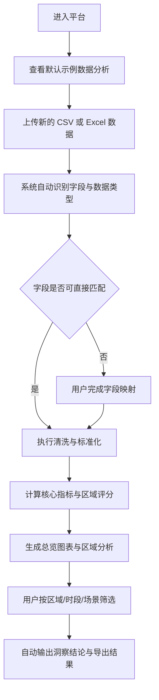

## 1. 产品概述
这是一个面向网络质量分析场景的可复用 Web 平台，支持上传新的香港网络质量 CSV/Excel 数据后自动清洗、分析并生成多维可视化结果。
- 主要解决“原始调查数据难快速汇总、跨区域对比困难、复用成本高”的问题，面向运营分析、网络优化、汇报展示等用户。
- 产品价值在于将一次性脚本分析升级为可持续复用的分析界面，后续替换数据文件后仍可快速产出图表、指标和区域洞察。

## 2. 核心功能

### 2.1 用户角色
| 角色 | 使用方式 | 核心权限 |
|------|----------|----------|
| 分析用户 | 直接打开网页 | 上传数据、查看图表、筛选分析、导出结论 |

### 2.2 功能模块
1. **总览页**：核心 KPI、全港概览、问题分布、各区评分、重点发现。
2. **区域分析页**：十八区横向对比、区域详情、问题类型、时段与场景影响分析。
3. **数据工作台页**：数据上传、字段识别、字段映射、数据质量提示、导出结果。

### 2.3 页面详情
| 页面名称 | 模块名称 | 功能描述 |
|-----------|-------------|---------------------|
| 总览页 | 顶部叙事区 | 展示平台标题、数据时间范围、样本量、上传状态、分析入口 |
| 总览页 | 核心指标卡 | 展示平均下载速率、平均时延、投诉率、满意度、SLA达标率、5G占比 |
| 总览页 | 香港地图感分区视图 | 用抽象区域卡片替代地图底图，突出十八区网络评分和异常程度 |
| 总览页 | 问题概览图表 | 展示主要网络质量问题分布、投诉占比、重复反馈占比 |
| 总览页 | 场景与时段洞察 | 展示港铁、商场、住宅、道路等场景在不同时段的表现差异 |
| 总览页 | 智能结论面板 | 自动生成“表现最佳区域”“问题最集中区域”“高峰期风险点”等结论 |
| 区域分析页 | 区域排行榜 | 对十八区按综合得分、下载速率、时延、投诉率等排序 |
| 区域分析页 | 区域详情卡 | 选择单一区域后展示基础指标、主要问题、主要场景、用户建议 |
| 区域分析页 | 对比分析图 | 支持两个或多个区域对比下载速率、时延、信号质量、投诉率 |
| 区域分析页 | 问题热度矩阵 | 展示“区域-问题类型”交叉热度，识别信号弱、网速慢、高延迟等聚集点 |
| 区域分析页 | 时段/制式切换 | 按早高峰、晚高峰、深夜以及 4G、5G、4G/5G切换进行分析 |
| 数据工作台页 | 数据上传 | 支持上传 CSV、XLSX 文件，并展示文件校验状态 |
| 数据工作台页 | 字段映射器 | 当新数据列名不完全一致时，允许用户将原始字段映射到标准分析字段 |
| 数据工作台页 | 数据清洗提示 | 检查缺失值、异常值、日期格式、数值字段格式，并给出提示 |
| 数据工作台页 | 数据预览表 | 展示前几行样本及字段识别结果 |
| 数据工作台页 | 分析结果导出 | 导出筛选后的图表截图、摘要表格或 JSON 指标结果 |

## 3. 核心流程
用户打开网页后，可先查看默认示例数据生成的分析结果；当上传新的 CSV 或 Excel 后，系统自动识别字段并进行标准化处理，如果字段名称不一致则提示用户完成映射。数据校验完成后，系统重新计算核心指标、区域评分和可视化图表，并允许用户按行政区、场景、时段、网络制式、问题类型等条件筛选，最终输出可汇报的结论和导出结果。

## 4. 用户界面设计
### 4.1 设计风格
- 主色为深海军蓝、青绿色、电光青，辅以暖金色强调重点指标，整体风格偏“专业监测中枢 + 数据仪表盘”。
- 按钮采用圆角矩形与半透明玻璃态混合风格，重要操作有发光边框和悬停动画。
- 字体采用具有科技感的标题字体搭配高可读性正文字体，突出分析系统和展示汇报两种使用场景。
- 布局采用桌面优先的沉浸式大屏结构，上方叙事区、中央核心图表区、下方多面板联动区。
- 图标建议使用简洁线性风格，避免卡通化；关键状态以点阵、信号条、波形等可视元素表达。

### 4.2 页面设计概览
| 页面名称 | 模块名称 | UI 元素 |
|-----------|-------------|-------------|
| 总览页 | 顶部叙事区 | 深色渐变背景、动态数据流装饰、大标题、副标题、上传按钮、时间范围标签 |
| 总览页 | 核心指标卡 | 发光边框卡片、数字滚动动画、趋势箭头、说明提示 |
| 总览页 | 图表区 | 柱状图、雷达图、热力图、环图、趋势线图，卡片间通过高低错落布局形成层次 |
| 区域分析页 | 排行榜与详情 | 左侧排行榜、右侧区域详情面板、悬停联动高亮、问题标签云 |
| 区域分析页 | 对比分析区 | 多系列折线图、分组柱状图、矩阵热图、筛选器工具条 |
| 数据工作台页 | 上传与字段映射 | 拖拽上传区、字段映射卡、状态标签、预览表格、错误提示条 |
| 数据工作台页 | 导出区 | 简洁操作面板、下载按钮、导出格式选择、摘要说明 |

### 4.3 响应式
- 采用桌面优先设计，适合演示、汇报和分析人员日常使用。
- 平板端保留主要筛选和图表浏览能力，图表区域改为纵向排列。
- 移动端以查看核心指标与简化图表为主，保留上传和基础筛选能力。
- 对悬停行为提供触屏替代交互，保证基础可用性。
