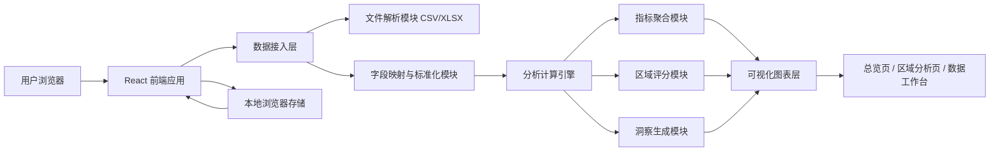
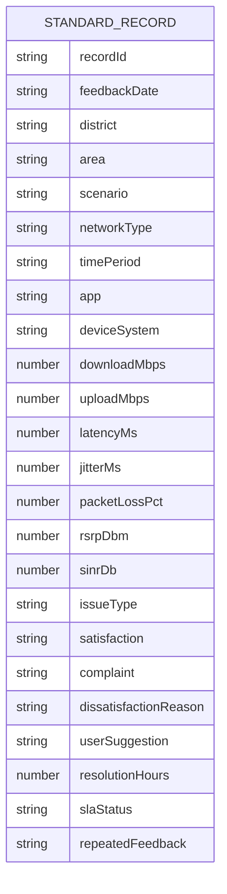

## 1. 架构设计


## 2. 技术说明
- 前端：React 18 + TypeScript + Vite
- 样式：Tailwind CSS 3 + 自定义 CSS 变量 + 少量动效样式
- 图表：Recharts
- 文件解析：Papa Parse 处理 CSV，SheetJS 处理 XLSX
- 状态管理：React Context + Hooks
- 数据处理：纯前端本地计算，不依赖后端服务
- 初始化工具：Vite

## 3. 路由定义
| 路由 | 用途 |
|-------|---------|
| / | 总览页，展示默认数据或当前上传数据的全局分析 |
| /districts | 区域分析页，查看十八区对比和单区详情 |
| /workspace | 数据工作台页，上传新数据、映射字段、预览和导出 |

## 4. API 定义
本项目默认采用纯前端架构，无远程后端 API。核心逻辑通过本地 TypeScript 模块完成。

### 4.1 标准字段类型定义
```ts
export type StandardRecord = {
  recordId: string;
  feedbackDate: string;
  district: string;
  area: string;
  scenario: string;
  networkType: string;
  timePeriod: string;
  app: string;
  deviceSystem: string;
  downloadMbps: number;
  uploadMbps: number;
  latencyMs: number;
  jitterMs: number;
  packetLossPct: number;
  rsrpDbm: number;
  sinrDb: number;
  issueType: string;
  satisfaction: string;
  complaint: string;
  dissatisfactionReason: string;
  userSuggestion: string;
  resolutionHours: number;
  slaStatus: string;
  repeatedFeedback: string;
};
```

### 4.2 字段映射结构
```ts
export type FieldMapping = {
  [standardField: string]: string | null;
};
```

### 4.3 计算结果结构
```ts
export type AnalyticsSummary = {
  sampleSize: number;
  avgDownload: number;
  avgUpload: number;
  avgLatency: number;
  complaintRate: number;
  satisfactionRate: number;
  slaPassRate: number;
  networkTypeShare: Array<{ name: string; value: number }>;
  issueDistribution: Array<{ name: string; value: number }>;
  districtScores: Array<{
    district: string;
    score: number;
    avgDownload: number;
    avgLatency: number;
    complaintRate: number;
    satisfactionRate: number;
  }>;
};
```

## 5. 服务端架构图
本项目不设置服务端，部署后以静态站点形式运行。若未来需要多人协作、历史版本管理或在线存储，可扩展后端服务，但当前版本不依赖后端。

## 6. 数据模型
### 6.1 数据模型定义


### 6.2 数据定义说明
- 输入层支持 `CSV` 与 `XLSX`。
- 系统内维护一份标准字段字典，用于将“香港行政区”“地区”“区域”等近义列名映射到统一字段。
- 对数值字段执行解析和异常值保护，无法转换的数据置为空并在数据质量面板提示。
- 对日期字段统一标准化为 `YYYY-MM-DD` 形式，用于时间范围展示和按月扩展。

## 7. 核心分析设计
- 建立综合网络质量得分，默认由下载速率、时延、投诉率、满意度、SLA达标率加权计算，支持后续调整。
- 对区域进行多维聚合，输出平均下载速率、平均时延、问题占比、投诉占比、5G占比等指标。
- 通过“区域 x 问题类型”“场景 x 时段”二维矩阵识别热点问题。
- 自动生成摘要结论，例如最优区域、最差区域、高峰压力区域、室内覆盖薄弱区域。

## 8. 复用性设计
- 内置默认示例数据，首次打开即可分析，无需依赖外部数据。
- 上传新文件后自动重跑全量分析，不写死列名、不依赖固定文件名。
- 通过字段映射器兼容同义列名和不完全一致的数据结构。
- 将解析、清洗、聚合、打分、图表配置拆成独立模块，便于后续替换数据主题或扩展到其他城市。
- 所有图表均从标准化后的分析结果对象渲染，避免页面组件与原始数据结构强耦合。
